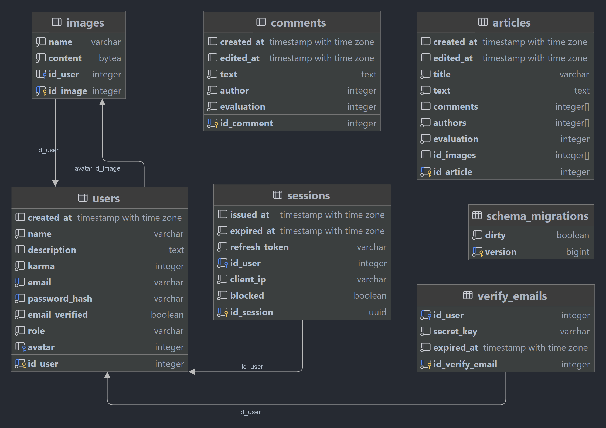

# Делаю бекенд учебного сайт

### Чему я тут научился (что я тут использовал):
- Кончно же **Golang** (интерфейсы, контексты, горутины ...)
- Сервер на **gRPC с HTTP Gateway**
- Зачем-то сделал ещё и **RESTful API на фреймворке Gin**
- Авторизация по 2м токенам, отдельно paseto и jwt токены, плюс верификация почты
- Использовал **Redis** и как брокер сообщений, и как кэш


- Развернул приложение в **Docker** (написал Dockerfile и docker-compose)
- **Mock-тесты** и обычные **unit-тесты**, с общим покрытием ~40%
- Поработал с **CI/CD** (GitHub Actions)
- Лучше освоил **linux**


- Имеется репликация данных в отдельный контейнер
- SQLC для генерации кода на Golang из SQL запроса
- Где необходимо, сделал транзакции
- Бд реализовал на **PostgreSQL**


  Мелочи:
- Сделал автогенерацию документации (в ./doc/)
- <p>>6000 строк отлаженного, работающего, лично написанного кода (+5500 сгенерированного)</p>
- Понял что Makefile — очень удобная штука
- Migrate для, собственно, миграций 
- Настроил красивый логгер


# Как запустить:
Можно запустить через Docker Compose:
```shell
docker compose up
```

Или можно выполнить команду на ubuntu (не рекомендую, может всё сломаться):
```shell
make from_scratch
```
Если выдаёт ошибку `--go-grpc_out: protoc-gen-go-grpc: Plugin failed with status code 1.`, то запустите сначала это, а потом ещё раз команду выше:
```shell
export GOPATH=$HOME/go
PATH=$PATH:$GOPATH/bin
```


Убрать всё что было создано:
```shell
make clean
```

## Сам проект:
- api — основное апи, на gRPC, со всеми реальизованными запросами и http gateway для работы ещё и по HTTP
- api_gin — апи на, собственно, gin (правда преимущества gin как фреймворка почти не использовались из-за его ненужности, т.к. для HTTP сделал http gateway для gRPC, на котором я и сделал основное api, т.е. gin тут как копия gRPC api) 
- db — папка с миграциями и кучей sql-зопросов к бд, которые при помощи sqlc конвертированы в исполняемые на go функции (+ там транзакции)
- doc — документации (в gRPC_API_doc.swagger.json описаны все запросы к api)
- my_mock — автосгенерированные моки для мок-тестов
- protobuf — сгенерированный код для запросов по gRPC
- proto — все запросы на gRPC
- redis — брокеры сообщений (воркеры) и кеш запросов, реализованные на редиске
- token — jwt и paseto токены авторизации (авторизация происходит по системе 2х токенов: refresh и access)
- tools — всякие дополнительные инструменты для реализации работы основного кода продукта (типа хеширование паролей, отправка имейлов, валидация данных...)


Архитектура бд:

